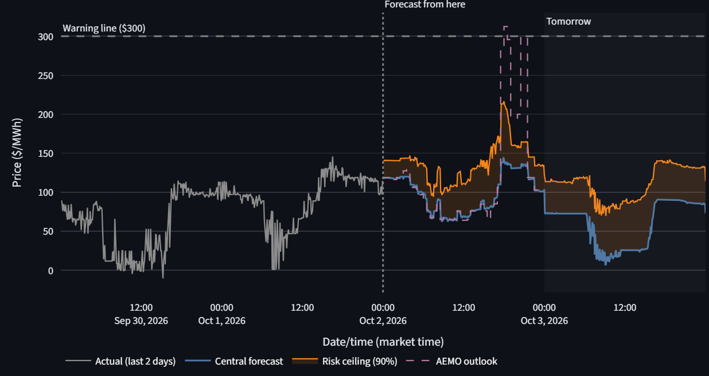
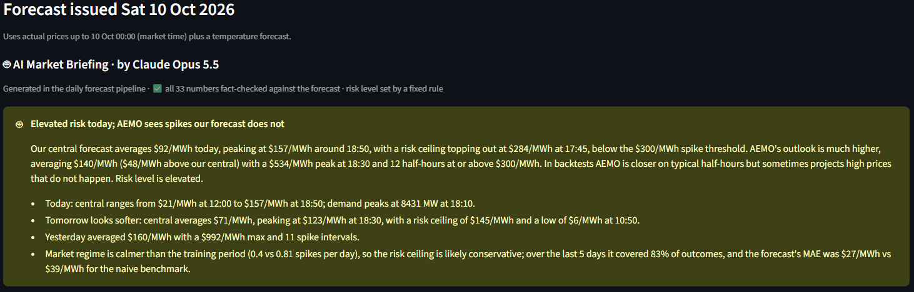
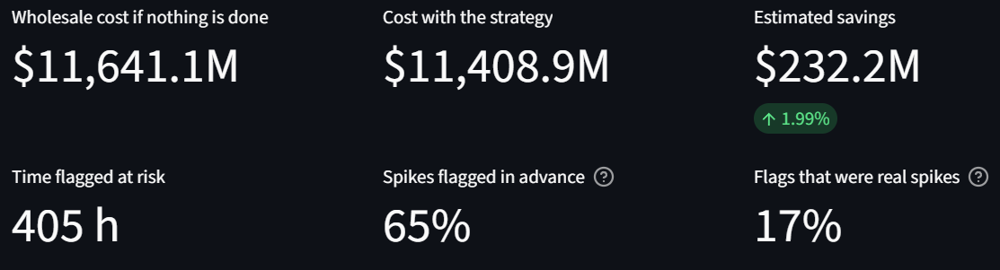
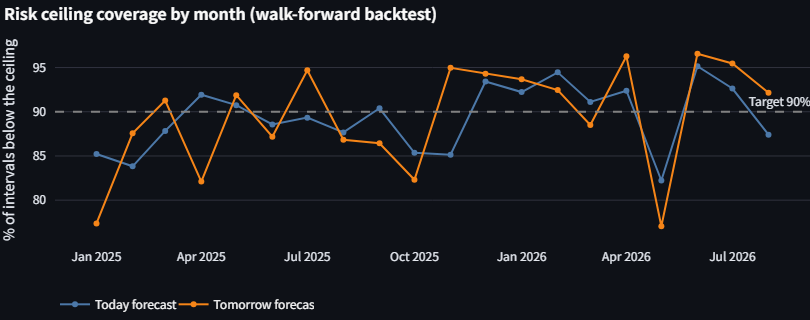
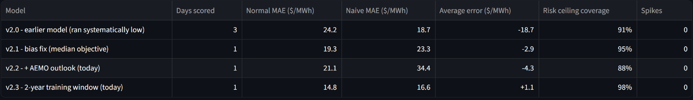
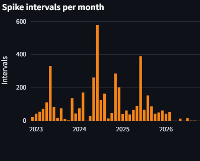
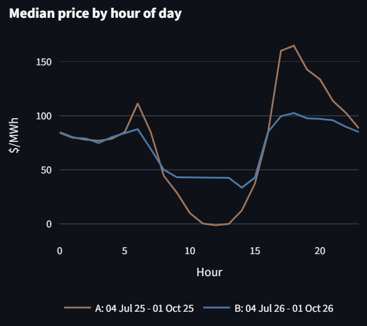

# AEMO Electricity Price Forecasting

A daily forecasting system for NSW electricity prices (RRP) and demand in
Australia's National Electricity Market (NEM). Every morning it forecasts
**today and tomorrow**, keeps a record of how past forecasts turned out, and
flags when the market has stopped behaving like the data the models learned
from. Runs end-to-end on GitHub Actions and a Streamlit dashboard.

**[Live Dashboard](https://aemo-electricity-forecasting-xhtf7sj4xqjesgknueoqza.streamlit.app/)**
(hosted on Streamlit Community Cloud's free tier, which puts the app to sleep
when nobody has visited for a while; if you see the sleep page, click "Yes,
get this app back up!" and it loads in about 30-60 seconds)

## What this project does

NEM prices can swing from ~$50/MWh to over $20,000/MWh within minutes when
supply is tight, and can fall below zero when renewables flood the market.
A single "expected price" hides that risk, so every forecast has two parts:

1. **Central forecast**: the most likely price, for planning
2. **Risk ceiling**: a 90th-percentile upper bound that actual prices should
   stay below about 90% of the time

Early every morning (market time), GitHub Actions downloads the latest AEMO
data, retrains the models (on the last 2 years for today, 1 year for
tomorrow), issues a forecast for today (6-24h ahead) and tomorrow (24-48h
ahead), and commits it to the repo. The dashboard redeploys automatically.
The same run asks Claude for a short plain-English briefing of the forecast,
shown at the top of the Outlook tab (see [AI briefing](#ai-briefing)).

## Dashboard

| Tab | What it answers |
|---|---|
| 🔮 **Outlook** | What will prices look like today and tomorrow, and when is the risk highest? |
| 🎯 **Track record** | How did the forecasts saved before each day compare with what actually happened? |
| 🌡️ **Market regime** | Is the market calmer or spikier than the models' training period? Compare any two periods side by side |
| 💰 **Risk strategy backtest** | What would acting on the risk ceiling have saved, and how many warnings were real spikes? |



*Outlook tab: the shaded band runs from the central forecast up to the risk ceiling; the dashed line is AEMO's own outlook for today.*



*AI Market Briefing at the top of the Outlook tab: written by Claude in the daily pipeline from facts computed in code; every number is checked against the forecast before it is saved (see [AI briefing](#ai-briefing)).*



*Risk strategy backtest tab (today's forecast, Jan 2025 - Aug 2026, warning line $300, 5-minute intervals). Most flags are precautionary: the ceiling is a 90% upper bound, not a spike prediction.*

## Results

Walk-forward backtest, January 2025 to August 2026 (20 months). For each
month, the models were trained only on data before it (730 days for today,
365 for tomorrow), then forecast every day of that month. "Normal" means
prices below $300/MWh. The naive benchmark repeats the price at the same time
on the latest day known at issue.

| Horizon | Normal MAE | Naive MAE | Normal R² | Months beating naive | Risk ceiling coverage (target 90%) |
|---|---|---|---|---|---|
| Today (6-24h ahead) | **$21.56** | $42.70 | 0.675 | 20 / 20 | 89.3% |
| Tomorrow (24-48h ahead) | **$30.86** | $51.44 | 0.449 | 20 / 20 | 89.4% |

Demand forecast R²: 0.884 (today), 0.853 (tomorrow).



Coverage is close to the 90% target over the whole period but swings from
month to month, which is why the dashboard tracks it over time.

**Against AEMO's own outlook** (today's forecast vs AEMO's PD7DAY pre-dispatch
price published before 06:00, compared per half hour): typical error $13.5 vs
$15.6/MWh (better in 18 / 20 months), and the risk ceiling flagged 65% of
spikes with 20% of flags being real, vs 61% and 17% for AEMO's outlook.

What the models **cannot** do: predict how large a spike will be one or two
days out. Spike-period errors stay around $1,800-1,900/MWh, only modestly
better than the naive benchmark (~$2,100). That is why the risk ceiling exists
as a separate output rather than trying to fold spikes into the central
forecast.

Since 27 September 2026, every live forecast has also been saved before its
target day and scored once actual prices arrive; the dashboard's Track record
tab shows that forward-only record, split by model version.



*Track record tab (today's forecast, as of 4 October 2026). Each model
version has only one to three scored days so far, so this shows how the
record works rather than a result; the walk-forward numbers above are the
evidence.*

## Things I found along the way

**1. My first model's headline numbers relied on information a real forecast
wouldn't have.** The v1 price model (normal R² 0.57) used same-interval
actual demand, available generation, reserve margin and prices up to 5
minutes before. Its three most important features were all of this kind.
Rebuilding it with only what is known when the forecast is issued gave a
lower but honest baseline, which the results above are based on.

**2. A walk-forward backtest exposed a systematic bias.** The central model
(L2 loss on an arcsinh-transformed price) under-predicted in **every one of
20 months**, by about $16/MWh on average. In arcsinh space, negative prices
sit very far from normal ones, so they drag the fitted mean down. Switching
to an L1 (median) objective on arcsinh(price / 100) removed the bias
(-$16.4 to -$0.2) and cut normal MAE by 12%. A single test month had not
revealed this.

**3. AEMO's own outlook is a strong input, but only up to the bid deadline.**
On its own, AEMO's 7-day pre-dispatch price was closer than my model on
typical half-hours, yet its average error was four times worse because it
occasionally projects very high prices that never happen. For days whose
generator bids aren't in yet (due around 12:30 the day before), it sits at
the market price cap in ~10% of half-hours, so it is only usable for today's
forecast. Feeding it into today's model as an input, and letting the model
learn when to trust it, cut normal MAE by 23% (better in 20 / 20 months) and
made the risk ceiling catch more spikes with fewer false alarms.

**4. The market changed under the models.** Spikes (≥ $300/MWh) fell from
40-389 per month in 2025 to 0-15 per month from March 2026, and negative
prices became rare. Public reporting links this to growing battery storage
([issue #5](https://github.com/ichirin0311/aemo-electricity-forecasting/issues/5)).
A model trained on the past year can quietly go stale, so the dashboard
compares recent spike rates with the training window and tracks risk ceiling
coverage month by month.

<p>
  
  
</p>

*Left: spike intervals per month. Right: median price by hour of day for the
same three months in 2025 (A) and 2026 (B). The evening peak flattened and the
midday solar dip filled in (from about $0 to about $43/MWh), consistent with
batteries charging at midday and discharging into the evening peak.*

But the change is not the whole story: at the same demand level spikes
became an order of magnitude rarer (9-10 GW: 1.9% of intervals in 2025, 0.06%
in 2026), yet above 11 GW they still happen ~10% of the time. So I tested
whether to drop or down-weight the older, spikier data. Training on only the
last 180 days made the risk ceiling miss most spikes on high-demand days
(tomorrow: 62% flagged → 23%), and recency weighting gave no consistent gain.
Extending today's window to 2 years kept normal-price accuracy and improved
every spike metric, so calm recent months don't make the model complacent
about extreme days.

**5. The "blocked" AEMO download was a User-Agent problem.** Automated
downloads had failed with HTTP 403, which looked like AEMO blocking scripts.
The actual cause was Cloudflare rejecting Python `urllib`'s default
User-Agent. With `requests`, the monthly CSVs download fine, including from
GitHub Actions runners.

## How it works

```
AEMO monthly price/demand CSVs ──┐
Open-Meteo temperature ──────────┼──> features known at issue time ──> LightGBM (per horizon) ──> data/forecasts/
AEMO PD7DAY price outlook ───────┘    (outlook: today's price only)     demand / central / Q90

GitHub Actions (daily): download → retrain → forecast → AI briefing → commit → Streamlit Cloud redeploys
```

### AI briefing

After the forecast is saved, `src/ai_summary.py` turns it into a short
briefing with one call to the Claude API (Anthropic Python SDK). It is a
pipeline step, not a chatbot: the dashboard only reads the saved result.

- **Facts in, prose out.** Code computes a small JSON of rounded facts:
  each day's central average and peak, the highest risk ceiling and hours at
  or above $300, AEMO's outlook and how far it is from ours, yesterday's
  actuals, the last 7 days' live track record, and the market regime. Claude
  sees only this, with instructions not to speculate about causes.
- **The risk level is a fixed rule in code** (low / elevated / high from the
  risk ceiling and AEMO's outlook), not the model's judgement.
- **Structured output and a number check.** The response is constrained to a
  JSON schema (headline, summary, key points). Every number and HH:MM time
  in it must match a fact; if one doesn't, the draft is rejected and kept in
  the log for review.
- **Never breaks the forecast.** If the key is missing, the API fails, or
  the check rejects the draft, a deterministic template briefing is saved
  instead and the dashboard says so.
- **Logged like the forecasts.** `data/forecasts/ai_summary_log.jsonl` keeps
  one entry per day with the facts, the text, its source (`llm` or
  `template`), model, prompt version and token usage.

## Key modeling decisions

- **Only information available at issue time**: prices and demand up to the
  previous midnight, the same time on the latest day and a week earlier,
  calendar features, a temperature forecast, and (for today) AEMO's price
  outlook as published before 06:00. AEMO's CSV is refreshed at 00:00 market
  time, so a morning forecast always has yesterday complete.
- **Separate central and risk-ceiling models** rather than one blended
  prediction. Four blending/routing approaches were tried in v1 (classifier
  routing, dollar-scale and arcsinh-space blending, self-routing on the
  ceiling). All underperformed, because the spike classifier's precision was
  only ~18%.
- **arcsinh, not log**, for the price target: the -$1,000/MWh price floor
  forces a large log shift that flattens normal-range variation. The central
  model uses a scaled arcsinh with a median objective (see finding 2); the
  risk ceiling is LightGBM quantile regression at α = 0.9.
- **Rolling window, retrained daily**, with separate models for each
  horizon: 730 days for today, 365 for tomorrow (see finding 4).
- **AEMO market time is fixed UTC+10** (no daylight saving), so weather data
  is converted with `Etc/GMT-10`, not `Australia/Sydney`.

## Project structure

```
run_day_ahead.py           daily forecast (today + tomorrow); run by GitHub Actions
run_backtest.py            walk-forward evaluation (monthly retrain)
src/day_ahead.py           data assembly, features, training, forecasting
src/aemo_downloader.py     AEMO monthly CSV download with caching and retries
src/aemo_pd7day.py         AEMO PD7DAY outlook: archive + live download, as-of-issue selection
src/ai_summary.py          daily plain-English briefing via the Claude API, with a number check
src/dashboard_data.py      data loading and analysis for the dashboard
src/app.py                 Streamlit dashboard
experiments/               the experiment behind each modeling decision (feasibility,
                           target transform, AEMO outlook, training window)
.github/workflows/         daily pipeline
data/forecasts/            latest forecast, forecast log and AI briefing log (updated daily)
data/backtest/             walk-forward results

main.py, src/pipeline.py,  v1: fixed-2025 pipeline, still run daily as a
src/train.py               regression test of the data sources (see below)
```

## Setup

```bash
pip install -r requirements.txt
```

Open the dashboard (uses the forecasts and backtest results in the repo, no downloads):

```bash
python -m streamlit run src/app.py
```

Issue a fresh forecast for today and tomorrow (downloads AEMO and Open-Meteo data):

```bash
python run_day_ahead.py
```

The AI briefing needs `ANTHROPIC_API_KEY` (a repository secret in GitHub
Actions). Without it a template briefing is used. To regenerate the briefing
for the latest saved forecast:

```bash
python -m src.ai_summary
```

Backtest as if the forecast had been issued on a past morning (prints only):

```bash
python run_day_ahead.py 2025-12-01
```

Re-run the 20-month walk-forward evaluation (several minutes):

```bash
python run_backtest.py
```

## v1 (archived results)

The first version trained on January-October 2025 and tested on December
2025, using supply-side features from AEMO's DISPATCHREGIONSUM table via
[NEMOSIS](https://github.com/UNSW-CEEM/NEMOSIS). It still runs daily
(`main.py`) as a check that the data sources work.

| Metric | Value |
|---|---|
| Demand forecast R² | 0.9665 |
| Price forecast R² (normal conditions, < $300/MWh) | 0.5667 |
| Price forecast MAE (normal conditions) | $19.22 |
| Risk ceiling MAE (spike conditions) | $1,790.42 |

These numbers use same-interval actuals as inputs (see finding 1), so they
are not comparable with the v2 forecast results above.

## Data sources

- [AEMO aggregated price and demand data](https://www.aemo.com.au) (5-minute, NSW1)
- AEMO PD7DAY pre-dispatch price outlook ([NEMweb](https://www.nemweb.com.au) MMSDM archive and current reports)
- [Open-Meteo](https://open-meteo.com): Historical Weather API and Forecast API
- [NEMOSIS](https://github.com/UNSW-CEEM/NEMOSIS) for AEMO MMSDM tables (v1 only)

## Disclaimer

The risk strategy backtest is a simplified proof of concept. It assumes
flagged demand could be curtailed at no cost and does not constitute
financial or trading advice.
